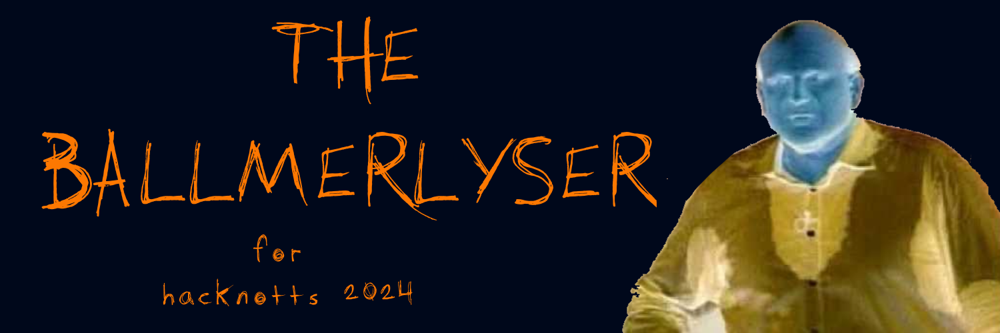

# The Ballmerlyser

Anyone who's anyone knows about the Ballmer Peak, the optimal blood alcohol level for programming skill. But, after many a drunk programming session turned into a drunk party session, we needed a better way to maintain the Ballmer Peak. Enter: **The Ballmerlyser.** Armed with nothing but a blood-alcohol sensor, a Raspberry Pi and borrowed hardware, we're working on a breathalyser which will tell the user how much to drink/sober up for optimal programming ability.
